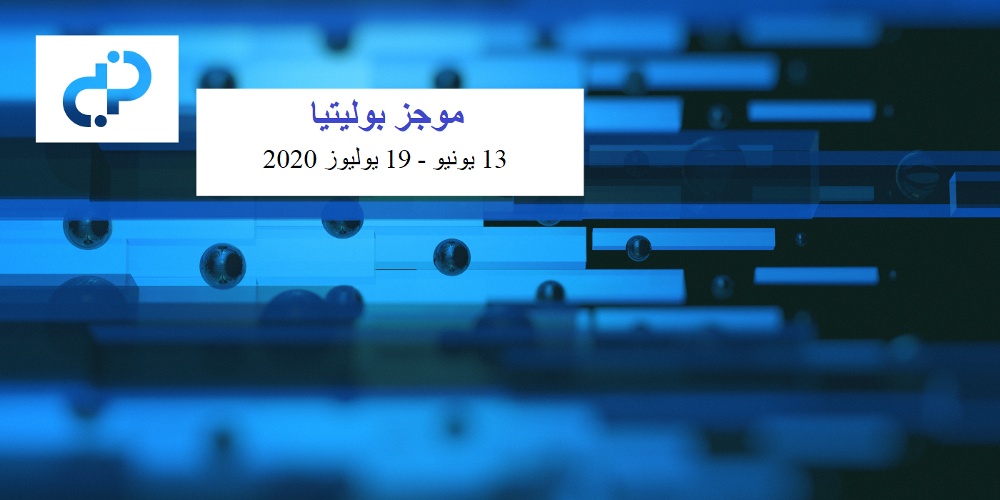

# مجلة موجز بوليتيا - العدد 33 - 13 يونيو - 19 يوليوز 2020

**رصيد الخزينة: 625,512 DCR (ما يقارب 12,650+ DCR / شهريًا) - 9.64 مليون ( أزداد 195 ألف دولار شهريًا) بناءً على سعر 15.42 دولار ل DCR**

## مقترحات جديدة

**[العلاقات العامة من Monde للعلاقات العامة](https://proposals.decred.org/proposals/c81926b1958e54b2f294085da4ab03e9a63223f8ccd32e74a43493bf62de6185) - المرحلة الثانية**

نشر في 10 يوليوز بواسطة lindseymmc | يضم 17 تعليقا

يطلب هذا الاقتراح مواصلة تمويل Monde PR بمبلغ 3500 دولار في الشهر لعام آخر، بعد مضي 6 أشهر على [اقتراح](https://proposals.decred.org/proposals/bdd02d82547bd78fc95939c1e2b3df21ebec6e8d31444df5bea3c133b0199f05) المرحلة الأولى. يتضمن الإقتراح [رابطًا](https://github.com/decredcommunity/pr/blob/release/monde-pr-media-coverage.csv) لملف csv مع تأمين كل التغطية خلال المرحلة 1، وهو ما ركزت عليه المناقشة.

تؤيد التعليقات عموما لجهود التي بذلتها lindseymmc@، وتقدر التقارير الخاصة بالمرحلة الأولى. أما النقاط الرئيسية التي أثيرت بشأن كيفية تحسين المرحلة الأولى فتتعلق بنسبة التغطية التي لا تذكر ديكريد إلا بصورة عابر، وبالمواقع التي تنشر فيها القصص. وقد قام bee@ بتفصيل بعض التحليلات للتغطية في هذا [التعليق](https://proposals.decred.org/proposals/c81926b1958e54b2f294085da4ab03e9a63223f8ccd32e74a43493bf62de6185/comments/17)، مع 46 موضوعا من أصل 179 ذكر فيها ديكريد في العناوين، مع إنخفاضها إلى 4 مواضيع عند إزالة العناصر المكررة المشتركة. "بعبارة أخرى، من بين المقالات الـ 34 المذكورة، 7 منها فقط تحتوي على فقرة واحدة على الأقل تذكر ديكريد، ولا يوجد أي مقال خاص بها فقط.

**[ملصقات الواقع المعزز](https://proposals.decred.org/proposals/dedf452074752d7e29304a0566643feb26d1d130596e04c613e15de113ac2d08)**

نشر في 16 يوليوز بواسطة mission | يضم 11 تعليقًا

يطلب هذا الاقتراح مبلغ 15,000 دولار لعشرة ملصقات للواقع المعزز، أو 1,500 دولار لكل منها. وقد قدم mission@ وشركاؤه [أمثلة](http://www.users.pjwstk.edu.pl/~s2946/decred.pdf)  عن عملهم السابق في الواقع المعزز، واقترحوا إنشاء قناة يمكنهم فيها تلقي ملاحظات حول الملصقات من المجتمع.

وتشكك التعليقات في عدم وجود تفاصيل حول العملية أو الدوافع في الاقتراح وصعوبة تقييم نوعية الملصقات وما إذا كانت تستحق قيمة 1,500 دولار لكل واحدة منها.

## المقترحات المعتمدة

**[برنامج ديكريد لمكافأة إيجاد العلة: المرحلة 3](https://proposals.decred.org/proposals/2170df6af2cda7d048039d893cc8438b001577989441a33709820f56df7075c0)**

نشر في 1 يونيو بواسطة degeri | عُدل في 6 يونيو | 8 تعليقات (0+)

أرقام التصويت النهائية: 12,746 أصوات بنعم و 262 بلا (98% نعم) - مشاركة الناخبين 32%.

ارتفعت نسبة الموافقة على المكافأة في المرحلتين الأولى (90%) والثانية (94%)، تمثل هذه نسبة الموافقة الثالثة الأعلى من بين جميع المقترحات بنسبة 98%.

## المقترحات المرفوضة

**[إنتاج المحتوى لـديكريد باللغة الروسية](https://proposals.decred.org/proposals/df11d7ac85061e6a02d6503555e585a1a37fffd82101eeea14670537c951926f)**

نشر في 19 يونيو بواسطة ivandecredfan | عدل في 23 يونيو | 23 تعليقًا

الأرقام النهائية للتصويت: 3,093 صوتت بنعم و 5,624 بلا (35.5% نعم) - مشاركة الناخبين 21%.

طلب هذا الاقتراح ميزانية قدرها 1,600 دولار شهريا لمدة 4 أشهر، بالإضافة إلى 1,600 دولار للعمل المنجز بالفعل (أي ما مجموعه 8,000 دولار) لإنتاج المحتوى الروسي. يتبع هذا [اقتراحًا](https://proposals.decred.org/proposals/92e3f2176b332c1aea5887acd2324c2cd730ec450e563df52ddae9d5927d5d36) مشابهًا من ivandecredfan@ في فبراير والذي تم رفضه بنسبة موافقة بلغت 21٪. ويركز الاقتراح الجديد على ترجمة أشرطة الفيديو الخاصة ب Exitus' إلى الروسية ، وكذلك ترجمة المحتوى المكتوب. وستدفع فواتير العمل بسعر 20 دولارا للساعة.

طلب الاقتراح أول الأمر ميزانية قدرها 2,000 دولار شهريا ولكن تم تخفيض ذلك استجابة للتعليقات المبكرة. وتعترض بعض التعليقات على الاقتراح الكبير نسبيا (80 ساعة في الشهر) مكرس لترجمة المحتوى إلى اللغة الروسية من قبل متعاقد لا يعمل في جوانب أخرى من المشروع أيضا. كما ذكرت عدة تعليقات صعوبة تقييم نوعية أشرطة الفيديو هذه دون الحصول على مزيد من المعلومات من أعضاء المجتمع الناطقين بالروسية كمشكلة. وأخيرا ، فإن العدد المنخفض من وجهات النظر والتصفيقات على محتوى ivandecredfan@ الذي أنتج حتى الآن اعتبر سلبيا من جانب بعض المعلقين.

## أخبار أخرى

تلقت المشكلة المتعلقة بالتعليقات التي تم إجراؤها أثناء قيام الخادم بتسجيل اليوميات (مما أدى إلى عدد قليل من التعليقات المتكررة) حلاً سريعًا (تم رفض التعليقات أثناء هذه النافذة)، ومن ثم سرعان ما يصبح ذلك حدثاً يومياً بدلاً من حدوثه كل ساعة.

في 8 يونيو، قام lukepb@ [بالتغريد](https://twitter.com/lukebp_/status/1270075883487850496) حول طلب الإقتراح للعمل على الواجهة الأمامية بواسطة amass@ الذي يتم دمجه. وقد تمت الموافقة الآن على طلب الإقتراح على شبكة الإختبار، وتوضحت عملية طلب الإقتراح اللاحقة التي فاز فيها اقتراح قلعة ديكريد تحت سطح الماء.

قام المساهمون من مقترح التسويق والفعاليات بأمريكا اللاتينية، الذي تم تمريره بالكاد بموافقة 60.4%، باستطلاع رأي للمجتمع على [ريديت](https://www.reddit.com/r/decred/comments/gzw6hl/what_are_the_thoughts_of_the_394/) حول أسباب عدم التصويت، في محاولة لتحسين أدائهم وآفاق التجديد. كما تم نشر [التقرير](https://www.reddit.com/r/decred/comments/hn4sve/activities_report_decred_en_espa%C3%B1ol_proposal_2/) الأول من الاقتراح.

قدم اقتراح يقترح اسماً جديداً للمشروع ("تطور البتكوين")، ولكن من دون تفاصيل التنفيذ اعتُبِر المشروع غير جاهز للنشر. قام Decredinator@ [بنشر](https://www.reddit.com/r/decred/comments/hh2ult/a_better_name_for_decred_to_broaden_the_reach_of/) المقترح ليناقش.

قبل نشر الموجز مباشرةً، تم [الكشف](https://matrix.to/#/!qYpAAClAYrHaUIGkLs:decred.org/$LFaTgEraOPCXQ0HMl0wM8aVmko-cBCToR76jNOgQfTg?via=decred.org&via=matrix.org&via=planetdecred.org) عن [مقترح مسبق](https://pastebin.com/LqqWH0sJ) جديد في غرفة proposals#، للحصول على 51،500 دولار لعمليات الدمج في موقعين للسفر، بالإضافة إلى العروض الترويجية ذات الصلة.

## عن هذا العدد

تستند بيانات بوليتيا لهذا العدد إلى هذا [الإيداع](https://github.com/decred-proposals/mainnet/commit/0ca1a6fd3958e60f53db27d624d47a0e18d1c7e5).

تم تأليف محتوى هذا الإصدار بواسطة richardred@ مع نصائح وإصلاحات من bee@ وdegeri@.

حقوق الصورة: sænder@

النسخة الأصلية للعدد 33 من مجلة موجز بوليتيا متوفرة على هذا الرابط [هنا](https://medium.com/politeia-digest/issue-33-june-13-july-19-2020-68af4a9169eb)

تمت الترجمة إلى اللغة العربية بواسطة: arij@. قام بالمراجعة abdulrahman4@.

