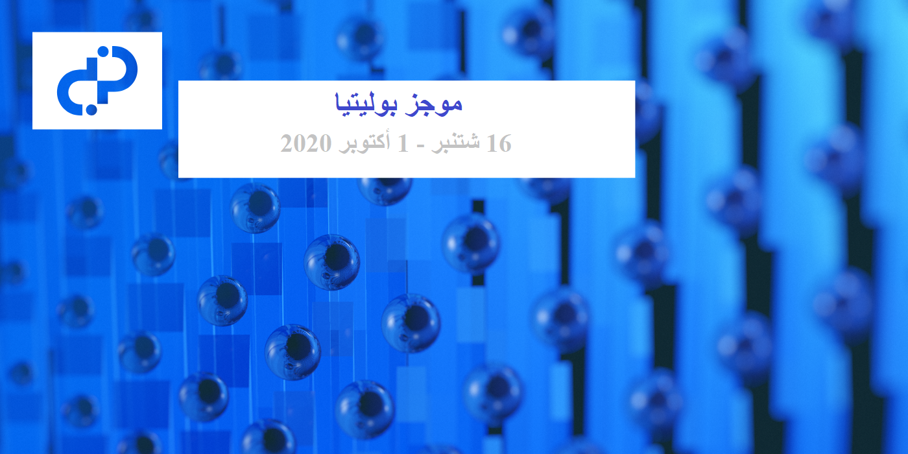

# مجلة موجز بوليتيا -العدد 37 - 16 شتنبر - 1 أكتوبر 2020

**رصيد الخزينة: 639,258 DCR (ما يقارب 12,200+ DCR / شهريًا) - 7.6 مليون دولار أمريكي ( يزداد 146 ألف دولار شهريًا) بناءً على سعر 11.95 دولار ل DCR**

## الاقتراحات المفتوحة للتصويت

**[التسويق الشعبي - إنماء مجتمع ديكريد (withDecred.org)](https://proposals.decred.org/proposals/2bf72e6)**

تم النشر في 16 شتنبر بواسطة m_ax | تم تعديله في 29 شتنبر | تلقى 18 تعليقًا

يطلب هذا المقترح المُقدَّم من طرف Pavel Svitek ميزانية قدرها 6485 دولارًا، مقسمة إلى 5,000  دولار أمريكي للعروض الترويجية كهِبات DCR و 297 دولارًا أمريكيًا شهريًا لمدة 5 أشهر من أجل صيانة وتطوير موقع [withDecred.org](https://withDecred.org). قام pavel@ بقيادة تطوير الموقع، و قام pablito@ بكتابة المحتوى، مع مساهمات من El Capitan@، تمت المراجعة و التحرير بواسطة richardred@ و ammarooni@ بالإضافة إلى بعض المساهمين الآخرين. ويقدر الاقتراح أن تكلفة إنشاء الموقع تتراوح بين 7,000 و 8,000 دولار، ولكنه لا يطلب دفع هذه التكاليف بل يطلب بدلا من ذلك أموالا لاستخدامها في الترويج للموقع. ويصف جزء كبير من الاقتراح طريقة إجراء الهبات، التي سبق تجربتها وتطويرها منذ تقديم الاقتراح. يحتوي الإصدار النهائي من هذا الإقتراح على مشاركين يقومون بتغريد الصور التي تم الحصول عليها من withDecred.org التي لديها رسالة حول الديكريد ورمز الاستجابة السريعة QR مع أحدث تجزئة كتلة، للحد من الإدخالات الاحتيالية.

الموقع يختلف عن decred.org في أنه تم تصميمه حول مسار القمع، ويحتوي الخادم على برنامج تحليلات مثبت من الطرف الأول (لا يوجد عنوان IP أو معلومات شخصية مجمّعة) لفهم ما يقرأه الأشخاص وأين ينزلون.

تم تعديل الاقتراح ليشمل رابطًا إلى حلقة من [بودكاست](https://anchor.fm/staked-podcast/episodes/Interview-with-Pavel-Svitek-Co-founder-of-WithDecred-org-ek1749)  Staked التي يظهر فيها pavel@، ويوصي الأشخاص بالاستماع إليه من الدقيقة 20 إلى الدقيقة 25  للحصول على وصف أكثر اكتمالا لنهجه في التسويق لديكريد.

تؤيد التعليقات عموما الاقتراح وفكرة تجربة نماذج جديدة للإنتشار. في حين أن بعض التعليقات كانت تشككية وتقترح في بعض الأحيان تغييرات سطحية أو عميقة في النهج.

** [فاتورة العلاقات العامة/الموارد البشرية/التسويق لديكريد للفترة الممتدة ما بين 2016/2017/2018](https://proposals.decred.org/proposals/f279ed5)**

تم النشر في 23 شتنبر بواسطة alexsolo | تلقى 65 تعليقًا

يطلب هذا الاقتراح 12,000 دولار للعمل السابق الذي أنجزه alexsolo@ في الفترة الممتدة ما بين 2016 و 2017 و2018، لتغطية 380 ساعة من العمل. وتشمل الأنشطة التي يغطيها هذا الإقتراح إدارة صفحة على الفيسبوك و إنماء المجتمع على Slack و التويتر، وتنظيم الترجمات، وبعض انتصارات العلاقات العامة، بما في ذلك شخص حصل على وشم ديكريد في الفترة التي كان ينشر فيها alexsolo@ على الفيسبوك. ويوضح هذا الاقتراح كيف أن التأخير الطويل قبل تقديم اقتراح لهذا العمل راجع إلى سوء فهم، حيث قدموا التفاصيل عن العمل المنجز وتوقعوا أن يتم الدفع لهم ولكنهم لم يتلقوا الدفع.

وصفت العديد من التعليقات على الاقتراح التفاعلات السلبية ل alexsolo@ حيث قام بنشر تعليقات سلبية حول ديكريد عبر مجموعة من المنصات في الفترة مابين 2018 و 2019، بعد أن توترت علاقته بالمشروع. قدم jy-p@ [بيانًا](https://proposals.decred.org/proposals/f279ed5695c9aff93e935a4665b67cff2f1032a2baffc6f3474cd0c97f9dde53/comments/48) لكيفية حدوث ذلك. وقد بدأ ذلك عندما دعا متعاقد alexsolo@ إلى غرفة دردشة المتعاقدين وتمت دعوته بعد ذلك لتقديم فواتير مفصلة لأي عمل يرغب في تلقي أجر مقابله، وولكنه لم يقدم أي فواتير وبعد عدة أشهر من فشل alexsolo@ في تقديم مساهمات ذات معنى، تمت إزالته من تلك القناة. وتنتقد تعليقات أخرى جوهر المساهمات المزعومة وما إذا كانت قيمتها تفوق القيمة السلبية للأنشطة اللاحقة.

## المقترحات المعتمدة

**[المرحلة الثانية من إنتاج محتوى فيديو ديكريد](https://proposals.decred.org/proposals/1e55a41)**

تم النشر في 2 شتنبر بواسطة Exitus | تلقى 17 تعليقًا (4+)

أرقام التصويت النهائية: صوت 12,034 بنعم، و 681 صوت بلا (95% نعم) - نسبة مشاركة الناخبين 31%

**[طلب تقديم مقترح RFP: تغيير الرسائل على موقع decred.org](https://proposals.decred.org/proposals/91becea)**

تم النشر في 9 شتنبر بواسطة richard-red | تم تعديله في 14 شتنبر | تلقى 7 تعليقات (2+)

أرقام التصويت النهائية: صوت 10,004 بنعم، و 1,784 صوت بلا (85% نعم) - نسبة مشاركة الناخبين 29%

أدت الموافقة على هذا الاقتراح إلى إعطاء فترة أسبوع من الزمن يمكن فيها تقديم مقترحات المرشحين. وبمجرد "انتهاء صلاحية" مدة مقترح طلب تقديم إقتراح في 28 شتنبر، لم يعد من الممكن تقديم مقترحات جديدة، لكن المقترحات التي تم تقديمها تظل مفتوحة للمناقشة والتعديل. عندما تنتهي المناقشة، سيعيد المشرفون تشغيل جولة التصويت، وسيتم الموافقة على الاقتراح الحاصل على أعلى درجة "بنعم أو لا" (إذا استوفى المعايير المعتادة).

هناك أربعة مقترحات ضمن المرشحين وتحت مراجعة المجتمع في الوقت الحالي:

### مقترحات طلب تقديم مقترح للرسائل

**[شعار "تطور المال" - إضافة خانة وصفحة "عادِل" إلى الموقع](https://proposals.decred.org/proposals/f0a00d5)**

العنوان الأصلي: مال عادِل يحكمه أصحاب الحصص من أجل نظام مالي أكثر عدله

تم النشر في 23 شتنبر بواسطة richard-red | تم تعديله في 29 شتنبر | تلقى 19 تعليقا

تمت صياغة هذا الاقتراح بتعاون مع Checkmate@ و jy-p@، ويهدف إلى 1) تغيير الشعار، و2) إضافة خانة وصفحة "عادِل" إلى الموقع، إلى جانب الخانات والصفحات المنشأة. وقد تضمن الاقتراح في الأصل التغيير إلى شعار "المال العادل الذي يحكمه أصحاب الحصص"، ولكن اقتراح jz@ لـ "تطور المال" يعتبر شعارًا أفضل وقد تم اعتماده من خلال هذا الاقتراح. ويتضمن الاقتراح النص الكامل للتغييرات المقترحة على الموقع decred.org. ولا تزال بعض الجوانب قيد المراجعة، بما في ذلك اختيار وترتيب الكلمات الرئيسية الثلاث (مع استطلاع تويتر). وتقدر ميزانية هذا الاقتراح بمبلغ 2,800 دولار (3,800 دولار كحد أقصى) لتغطية الرسوم البيانية والتنفيذ وكتابة الإعلانات والترجمة.

تنقسم التعليقات حول رسالة "عادل"، فالبعض يعارضها والبعض الآخر يؤيدها والبعض الآخر يقترح تعديلات على الصياغة والنظام.

**[حِكَايَة المنظمة المستقلة اللامركزية ل decred.org](https://proposals.decred.org/proposals/02d9fc2)**

تم النشر في 25 شتنبر بواسطة haon | تلقى 4 تعليقات

يقترح هذا الاقتراح استكشاف نهج رِوَائِيّ لنسخة الموقع، ويتعلق في الغالب بعملية تطوير نسخة جديدة. ويقدم الاقتراح نسخة عن هذا المفهوم "ديكريد عبارة عن منظمة مستقلة لامركزية تضم أفراداً يتمتعون بالسيادة يعملون معاً"، ولكن هذا يقدم باعتباره شرحا من طرف placeholder. يقود Haon@ جهدا مشتركا في إنشاء المحتوى لتوليد الأفكار قبل إصدار ثاني أكثر اكتمالا من التغييرات المقترحة. وتقدر ميزانية هذا الاقتراح بمبلغ 1,800 دولار (2,400 دولار كحد أقصى) لتغطية الرسوم البيانية والتنفيذ والترجمة.

تعبر التعليقات على الاقتراح عن الحماس لدمج السرد اللامركزي للمنظمة المستقلة، ولكن تم تحديد مفهوم "الأفراد ذوي السيادة" على أنه يرتبط بأفراد مظللين.

**[ديكريد - مؤسسة ثورية لامركزية](https://proposals.decred.org/proposals/d6ff458)**

تم النشر في 27 شتنبر بواسطة mrbulb | تلقى 6 تعليقات

يتبع هذا الاقتراح من المناقشة السردية في المنشور السابق لتحديد سرد بديل مع ديكريد كمؤسسة لامركزية ثورية. و يتعلق هذا الإقتراح أيضا بالعملية، في نسختها الأولية، و لكن سيتم إصدار اقتراح نسخة كاملة في المستقبل. ويقدر هذا الاقتراح بميزانية قدرها 4,300 دولار (بحد أقصى 5,000 دولار)، لتغطية الرسوم البيانية والتنفيذ وكتابة الإعلانات والترجمة.

**[D.R.E.A.M.](https://proposals.decred.org/proposals/4532397)**

تم النشر في 27 شتنبر بواسطة jz_bz | تلقى 11 تعليقا

تحكم ديكريد كل شيء حولي "Decred Rules Everything Around Me"، هو اقتراح "نصف جاد" يقدم مادة للتفكير والإلهام للمراسلة البديلة. ويبدو أن الشعار في الاقتراح، "تطور المال العادل"، قد تلقى شعبية كبيرة، وقد ألهم بالفعل اقتراحاً آخر بتغيير الشعار. ويقدم الاقتراح أيضاً اختبار برنامج إختبار للمطورين من أجل التسويق:  "إذا مدحك المطورون من أجل دقة المحتوى التسويقي الخاص بك، فقد أخطأت بشكل لا يصدق". مما يشير بدلا من ذلك إلى أنه "إذا رأيت مسوقين ناجحين، فلا يمكن تمييزهم عن الحمقى أو الزعماء الدينيين.” مساهمة أخرى جديرة بالملاحظة هي ثنائية كلمة Chad/Virgin (مع [ميم](https://twitter.com/jz_bz/status/1310639727477915648))، والتي تجادل ضد استخدام كلمات مثل "عادلة" و "مستديمة". في الختام، يدعو الاقتراح إلى انتشار مواقع ديكريد المتنافسة التي تختبر شعارات بديلة وتزيل الكلمات السيئة.

وتعبر التعليقات على الاقتراح عن تقديرها لصياغة الأفكار والحماس للشعار على وجه الخصوص.

## أخبار أخرى

اكتملت [إرشادات](https://github.com/decredcommunity/guidelines/blob/master/proposals.md) مقترحات بوليتيا التي أنتجها المجتمع (بقيادة bee@)، وتقدم هذه الوثيقة نظرة عامة شاملة حول عملية الاقتراح، مع نصائح لتقديم اقتراح أكثر نجاحاً.

## عن هذا العدد

تستند بيانات بوليتيا لهذا العدد إلى هذا [الإيداع](https://github.com/decred-proposals/mainnet/commit/60ce930dfe1aab89ec007dd0faa99e9754fa4a63).

تم تأليف محتوى هذا الإصدار بواسطة richard-red@ مع إصلاحات من bee@.

حقوق الصورة: sænder@

النسخة الأصلية للعدد 37 من مجلة موجز بوليتيا متوفرةعلى هذا الرابط [هنا](https://blockcommons.red/politeia-digest/issue037/)

تمت الترجمة إلى اللغة العربية بواسطة: arij@. قام بالمراجعة abdulrahman4@.
